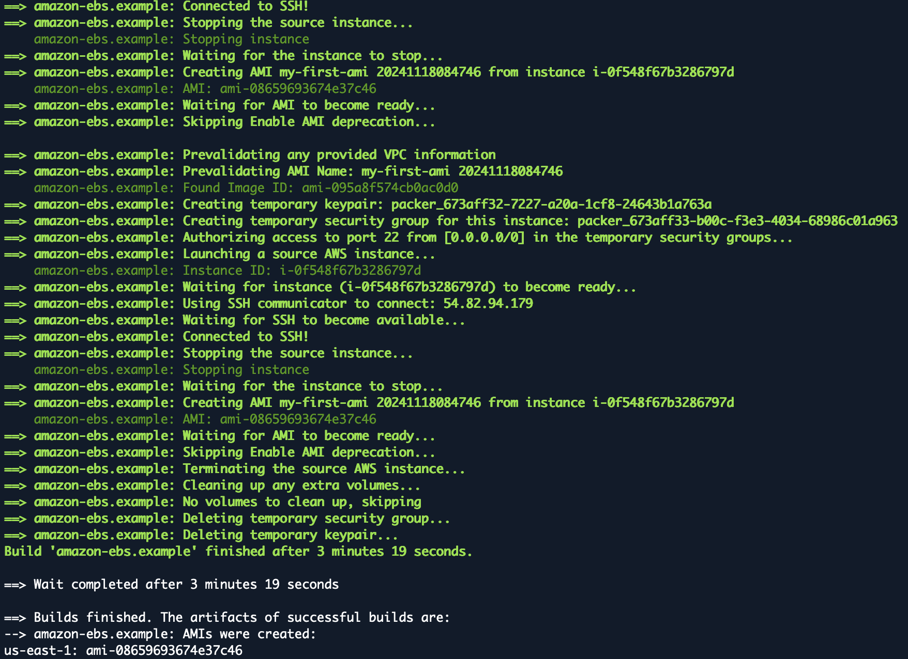

# Packer Lab 1 
## Lab objectives: 
* Install Packer
* Create Template
* Validate template
* Build an AWS image (AMI)

### Overview
Packer can build images for many platforms other than AWS, but AWS requires no additional software installed on your computer, and their free-tier makes it free to use for most people. This is why we chose to use AWS for the example. 

### Install Packer
The first thing we need to do is install Packer. To install the latest version, run the following: 
```bash
export VER="1.11.2"
wget https://releases.hashicorp.com/packer/${VER}/packer_${VER}_linux_amd64.zip 
unzip packer_${VER}_linux_amd64.zip
mkdir -p $HOME/.local/bin
mv packer $HOME/.local/bin
```
### The Template
Create a working directory
```bash
mkdir -p ~/LABS/packer/lab1
cd ~/LABS/packer/lab1
```
The configuration file used to define what image we want built and how is called a *template* in Packer terminology. Packer templates use the Hashicorp Configuration Language (HCL).

We'll start by creating the entire template; then we'll go over each section briefly. 

#### The Plugin Specification

Create a file `plugin.pkr.hcl` and fill it with the following contents:
```hcl
packer {
  required_plugins {
    amazon = {
      source  = "github.com/hashicorp/amazon"
      version = "~> 1"
    }
  }
}
```

This file specifies that the build we will perform requires the Amazon plugin to be able to use resources in the AWS Cloud.

### Download the AWS plugin

Run the command

```packer init plugin.pkr.hcl```

to download the specified plugin.

You should see output similar to:
```
Installed plugin github.com/hashicorp/amazon v1.3.3 in "/home/cloudshell-user/.config/packer/plugins/github.com/hashicorp/amazon/packer-plugin-amazon_v1.3.3_x5.0_linux_amd64"
```

Packer requires this to be able to interact with AWS.

#### The Build Specification

Create a file `example.pkr.hcl` and fill it with the following contents:

```hcl
# If you don't set a default, then you will need to provide the variable
# at run time using the command line, or set it in the environment. 
variable "ami_name" {
  type    = string
  default = "my-first-ami"
}

locals { timestamp = regex_replace(timestamp(), "[- TZ:]", "") }

# source blocks configure your builder plugins; your source is then used inside
# build blocks to create resources. A build block runs provisioners and
# post-processors on an instance created by the source.
source "amazon-ebs" "example" {
  ami_name      = "${ var.ami_name } ${ local.timestamp }"
  instance_type = "t2.micro"
  region        = "us-east-1"
  source_ami_filter {
    filters = {
      name                = "ubuntu/images/*ubuntu-focal-20.04-amd64-server-*"
      root-device-type    = "ebs"
      virtualization-type = "hvm"
    }
    most_recent = true
    owners      = ["099720109477"]
  }
  ssh_username = "ubuntu"
}

# a build block invokes sources and runs provisioning steps on them.
build {
  sources = ["source.amazon-ebs.example"]

}
```
This is a basic template that is ready-to-go. The source block configures a specific builder plugin, which is then invoked by a build. A source can be reused across multiple builds, and you can use multiple sources in a single build. A builder plugin is a component of Packer that is responsible for creating a machine and turning that machine into an image.

In this case, we're only configuring a single builder of type amazon-ebs. This is the Amazon EC2 AMI builder that ships with Packer. This builder builds an EBS-backed AMI by launching a source AMI, provisioning on top of that, and re-packaging it into a new AMI.

The additional keys within the source block are configuration for this builder, specifying things such as the instance type to launch, the source AMI to build from and more. The exact set of configuration variables available for a builder are specific to each builder and can be found within the documentation.

**Note:** that we set the ami_name argument of the source block to use the ```var.ami_name``` variable and also the ```local.timestamp``` value.

### Validate Template
Before we take this template and build an image from it, let's validate the template by running `packer validate example.pkr.hcl`. This command checks the syntax as well as the configuration values to verify they look valid. If the template is valid, there should not be any output. If there are any errors, this command will tell you.

```bash
packer validate example.pkr.hcl
```
If everything goes smoothly we can build the image! 

### Build an image
With a properly validated template, it is time to build your first image.
This is done by calling `packer build` with the template file. The output should look similar to below.
Note that this process typically takes a few minutes.

```bash
packer build example.pkr.hcl
```
 
You should see output similar to that shown below.

Spend the time to examine the output, noting
- Launching of the aws_instance virtual machine
- SSH connection to the virtual machine
- Stopping of the virtual machine
- Creation of the ```my-first-ami``` image
- Terminating (marking for removal) of the virtual machine
- Deletion of all temporary resources


At the end of running `packer build`, Packer outputs the artifacts that were created as part of the build.

Artifacts are the results of a build, and typically represent an ID (such as in the case of an AMI) or a set of files (such as for a VMware virtual machine). In this example, we only have a single artifact: the AMI in us-east-1 that was created.

This AMI is ready to use. If you wanted you could go and launch this AMI right now and it would work great.

### Verify that the image was created

You can list images which you own with the following command:

```aws ec2 describe-images --owner self --output text --region us-east-1 ```


