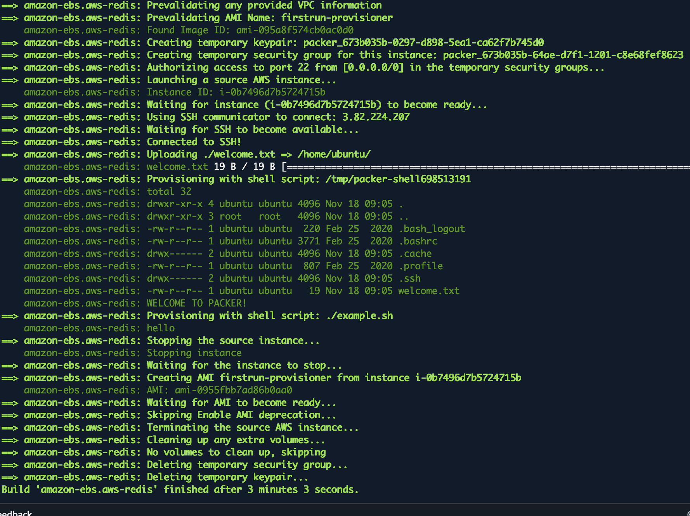

# Packer Lab 2

## Lab objectives: 
* Introduce provisioners
* Create firstrun.pkr.hcl template to use provisioners   

### Using provisioners   
Create and enter your working directory: 
```sh
mkdir -p ~/LABS/packer/lab2
cd ~/LABS/packer/lab2
```
Packer can customize your image using provisioners. This lab is going to introduce you to the `file` and `shell` provisioners.

Create a file named `welcome.txt` and populate it with: 
```
WELCOME TO PACKER!
```

Create a file named `example.sh` and add: 
```sh
#!/bin/bash
echo "hello"
```

Add execute permissions to `example.sh`
```sh
chmod +x example.sh
```

Create a template named `firstrun.pkr.hcl` and populate with:
```hcl
variable "ami_name" {
  type = string
  default = "${env("CUSTOM_AMI_NAME")}"
}

variable "region" {
  type    = string
  default = "us-west-1"
}

# source blocks are generated from your builders; a source can be referenced in
# build blocks. A build block runs provisioners and post-processors on a
# source.
source "amazon-ebs" "aws-redis" {
  ami_name      = "${ var.ami_name }"
  instance_type = "t2.micro"
  region        = "${var.region}"
  source_ami_filter {
    filters = {
      name                = "ubuntu/images/*ubuntu-focal-20.04-amd64-server-*"
      root-device-type    = "ebs"
      virtualization-type = "hvm"
    }
    most_recent = true
    owners      = ["099720109477"]
  }
  ssh_username = "ubuntu"
}

# a build block invokes sources and runs provisioning steps on them.
build {
  sources = ["source.amazon-ebs.aws-redis"]

  provisioner "file" {
    destination = "/home/ubuntu/"
    source      = "./welcome.txt"
  }
  provisioner "shell" {
    inline = ["ls -al /home/ubuntu", "cat /home/ubuntu/welcome.txt"]
  }
  provisioner "shell" {
    script = "./example.sh"
  }
}
```

### Build the image
To take advantage of the "env" function embedded in our default `ami_name` variable, we can set the env var referenced; then we don't have to pass the -var flag to the `packer build` command. 

```sh
export CUSTOM_AMI_NAME="firstrun-provisioner"
packer build firstrun.pkr.hcl
```

If you want to use a `source_ami` instead of a `source_ami_filter` it may look something like this:
```
source_ami = "ami-fceotj67
```

After running your `packer build` you should see output stating the image was created successfully.

Review the output and confirm the provisioners ran without error.

Observe
- the insertion of welcome.txt and example.sh files
- the output of the ls command




### Install packages
We'll use the built-in shell provisioner that comes with Packer to install Redis.

Perform the following steps:

- Copy the firstrun.pkr.hcl file to redis-server.pkr.hcl:

```cp firstrun.pkr.hcl redis-server.pkr.hcl```

- Rename the file firstrun.pkr.hcl as firstrun.pkr.hcl.bak:

```mv firstrun.pkr.hcl firstrun.pkr.hcl.bak```

  (so as not to be picked up by "packer build ." later on)

- Replace the build block in redis-server.pkr.hcl with the build block proposed below

Modify `redis-server.pkr.hcl` with the build block proposed below:

We'll explain the various parts of the new configuration following the code block below.

```hcl
build {
  sources = ["source.amazon-ebs.aws-redis"]

  provisioner "shell" {
    inline = [
      "sleep 30",
      "sudo apt-get update",
      "sudo DEBIAN_FRONTEND=noninteractive apt-get install -y redis-server",
    ]
  }
}
```

**NOTE:** The `sleep 30` in the example above is very important. Because Packer is able to detect and SSH into the instance as soon as SSH is available, Ubuntu actually doesn't get proper amount of time to initialize. The sleep makes sure that the OS properly initializes.

**Note:** This example does not create a source block for you; the source was set up in the previous lab, and should be defined above the build block in this example.

By default, each provisioner is run for every builder defined. So if we had two builders defined in our template, such as both Amazon and DigitalOcean, then the shell script would run as part of both builds. 

The one provisioner we defined has a type of shell. This provisioner ships with Packer and runs shell scripts on the running machine. In our case, we specify two inline commands to run in order to install Redis.

### Build

This time we will change the CUSTOM_AMI_NAME variable to prevent a conflict with our ```firstrun-provisioner``` image.

Set the following environment variable:

```
export CUSTOM_AMI_NAME="redis-provisioner"
```

With the provisioner configured, give it a pass once again through `packer validate` to verify everything is okay, then build it using `packer build redis-server.pkr.hcl`. The output should look similar to when you built your first image, except this time there will be a new step where the provisioning is run.

The output from the provisioner is too verbose to include in this tutorial, since it contains all the output from the shell scripts. But you should see Redis successfully install. After that, Packer once again turns the machine into an AMI.

If you were to launch this AMI, Redis would be pre-installed.

## Congrats!

