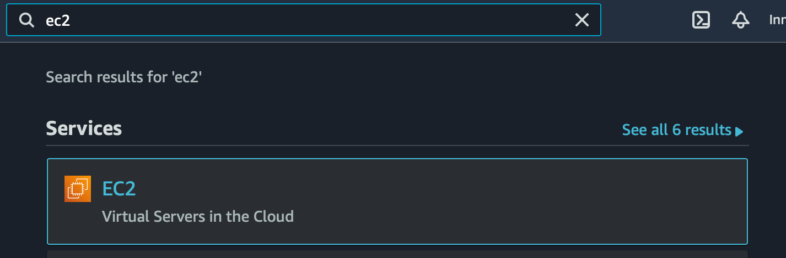
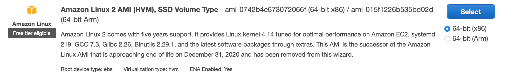

# Terraform Lab 6

## Overview
In this lab you will create some AWS resources using the console, and then import them into Terraform management. 

## Lab Setup

From the previous ```terraform/tf-lab5/learn-terraform-variables``` folder copy the contents to a new folder tf-lab6 as follows:

```sh

mkdir -p      ../../tf-lab6/
cp -a    $PWD ../../tf-lab6/
```

Then move to that new folder:

```sh
cd ../../tf-lab6/learn-terraform-variables
```


## Create instances in AWS Console
Create three EC2 instances in the AWS Console. 

1. Using the search bar at the top of the page, search for `ec2`, and click the first result as shown in the screenshot. 


2. In the EC2 dashboard click `instances`, and then `Launch instances`. 
3. At the top of the page in the ```Name and Tags``` box change Key to ```role``` and set Value to ```terraform```.
4. In the ```Application and OS Images (Amazon Machine Image)``` box, select the ```Amazon Linux``` image
<!--  -->

5. Keep the ```t2.micro``` instance type
6. In the ```Key pair``` box select ```Proceed without a key pair```
7. Keep the proposed Storage settings
8. In the ```Summary``` box at the bottom of the page, set the number of instances to 3
9. Click the ```Launch Instance``` button at the bottom of the page

## Create Terraform configuration 
While waiting for the instances to launch create a new working directory and configuration file. 
```sh
mkdir tf-lab4
```
Inside the new directory create a `main.tf` file and add a resource with the following attributes:
- type: `aws_instance`
- name: `tf-example-import`
- ami: AMI from instances created above
- instance_type: The type specified when creating the instance.
- count: `3`
- tags: `Name: TF-example-import`, `role: terraform`

Remember this resource block is for three instances. You will need to add the `count.index` to the `Name` tag. If you get stuck ask the instructor for assistance.

## Import the configuration 
Now that you've created the instances and the Terraform configuration, use the `terraform import` command to import the existing instances. 

If you get stuck check the help page `terraform import --help` or the [terraform documentation](https://www.terraform.io/docs/cli/import/index.html)


